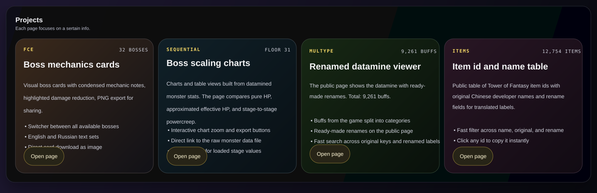
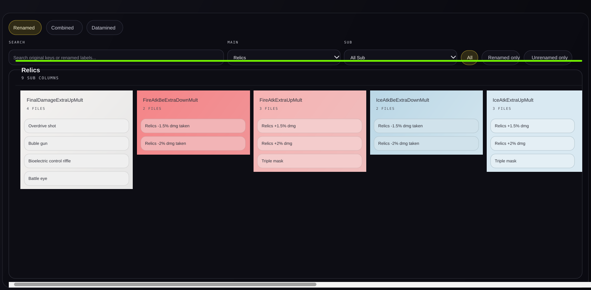
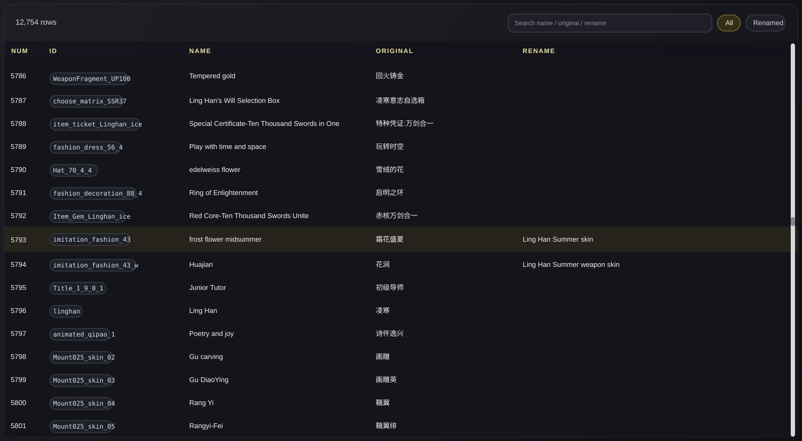

# TOF Datamine Site

  A compact Tower of Fantasy datamine viewer focused on readable public pages.
   
  Boss cards, Sequential charts, buff mapping, and item id tables live in one place.

## Overview

This repository contains a small datamine site for **Tower of Fantasy**.
The goal is simple: turn raw or semi-processed game data into public pages that are easy to scan, share, and update.

The `/datamine` area is the part intended for presentation:

- `/datamine/` gives a clean hub with entry cards for every public page.
- `/datamine/fce/` presents boss mechanics as visual cards with export support.
- `/datamine/seq/` shows Sequential boss scaling with charts and loaded values.
- `/datamine/multype/` organizes buff data into readable categories with search and filters.
- `/datamine/items/` lists item ids, original Chinese names, and rename fields in a fast table.

The site is mostly static-first and built with plain HTML, CSS, and JavaScript.
An Express server is used for local serving and for the small save endpoints used by editor-only flows.

## Project Notes

- The public pages are designed to be browsed directly from `/datamine`.
- JSON files stay close to the pages that consume them, which keeps edits straightforward.
- Styling is intentionally custom per page, while shared datamine pages still reuse a common visual base.

## Screenshots

### FCE

### Sequential

### Multype

### Items

## Why this repo exists

Raw game data is useful, but it is rarely pleasant to read in raw form.
This project exists to make that information easier to browse, compare, explain, and share without turning it into a heavy framework app.

## Help With Updates

If you want to add new data, update existing data, or fix something in the project, just contact me by any available method.

I will help, explain how the relevant datamine workflow is done, and provide full access.
