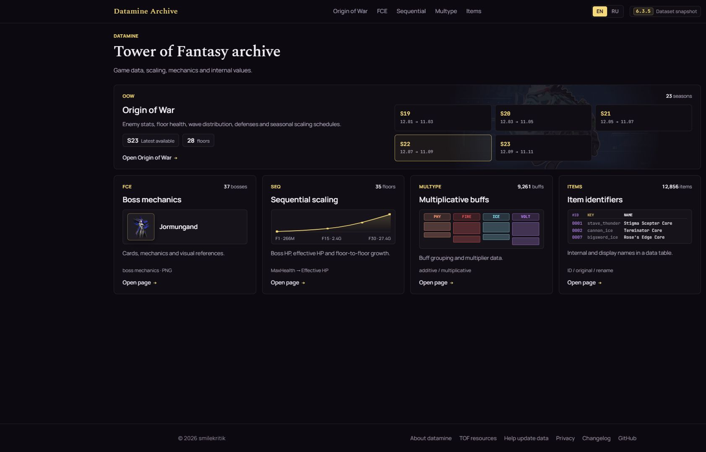
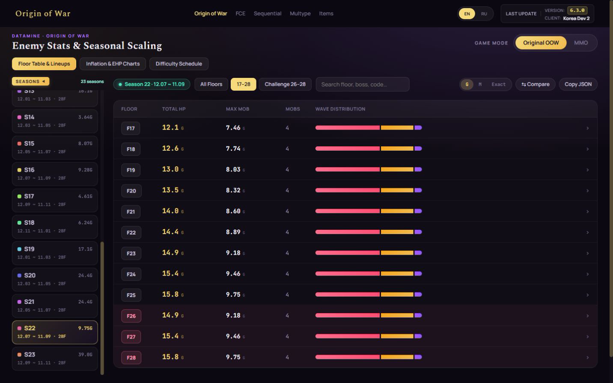
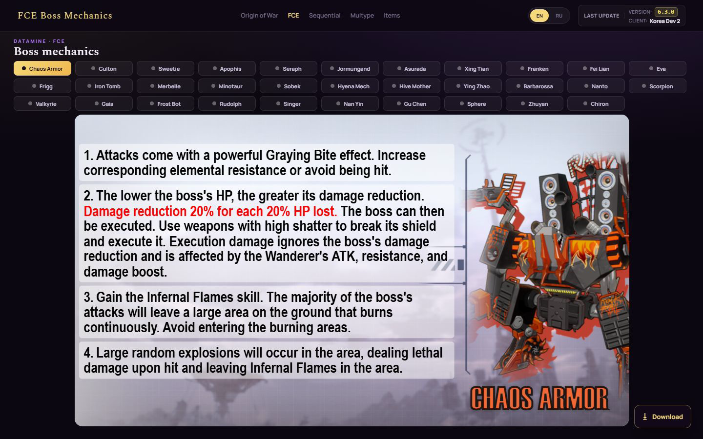
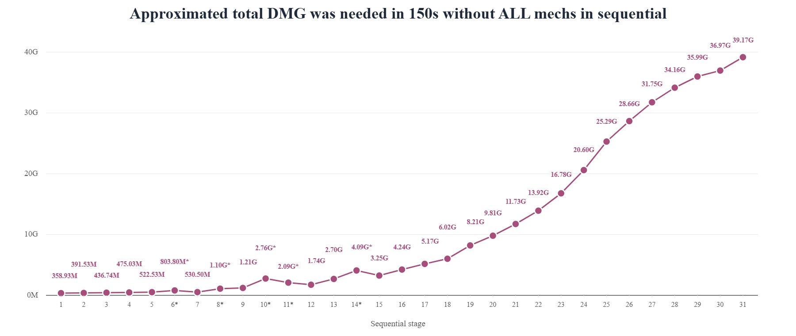
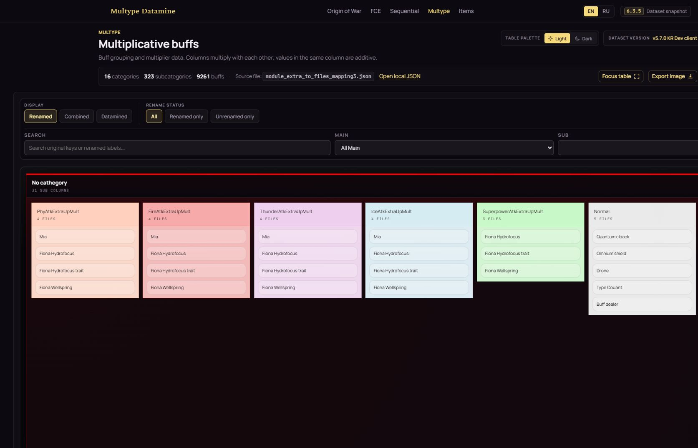
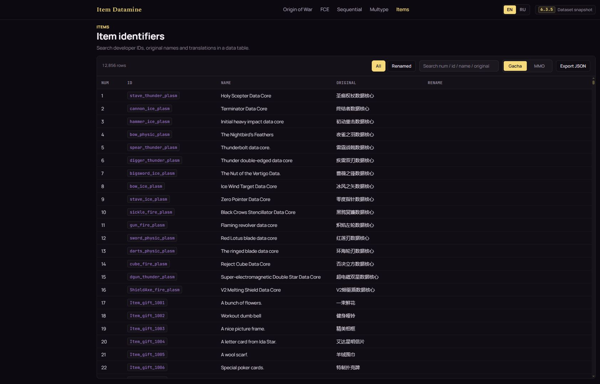

# TOF Datamine Archive

Tools and datasets for exploring Tower of Fantasy game data.

The public archive includes Origin of War seasons, FCE boss mechanics, Sequential scaling, buff stacking data, and item identifiers. This repository contains the static site, local editors, and the pipeline used to rebuild the published datasets from a fresh game export.

Open the archive at [tof.smilekritik.beer/datamine/](https://tof.smilekritik.beer/datamine/).

## Browse the archive

The public site includes these sections:

| Route | Content |
| --- | --- |
| `/datamine/` | Dataset counts and snapshot information |
| `/datamine/oow/` | Origin of War seasons, floors, enemy waves, HP/EHP, buffs, and rewards |
| `/datamine/fce/` | EN/RU boss-mechanics cards with PNG export |
| `/datamine/seq/` | Sequential boss HP/EHP tables, charts, and CSV/PNG export |
| `/datamine/multype/` | Buff groups, stacking relationships, themes, and PNG export |
| `/datamine/items/` | Global/Gacha and MMO item identifiers with JSON export |
| `/datamine/about/` | Data sources, calculations, and update workflow |
| `/datamine/projects/` | Related Tower of Fantasy resources |
| `/datamine/contribute/` | Instructions for contributing a fresh game export |
| `/datamine/changelog/` | Dataset and site changes |

The public interface supports English and Russian. Some game strings may remain untranslated when the source data has no localized value.

## Screenshots

| Archive hub | Origin of War |
| --- | --- |
|  |  |

| FCE boss mechanics | Sequential scaling |
| --- | --- |
|  |  |

| Multiplicative buffs | Item identifiers |
| --- | --- |
|  |  |

## Repository contents

The repository has four main parts:

- **`datamine/`**: self-contained public site and published data
- **`datamine-builder/`**: local authoring tools for OOW, FCE, Sequential, Multype, and Items
- **`pipeline/`**: processors and build scripts for fresh game exports
- **`tof-fast-datamine/`**: portable Windows export and processing package

The public site uses local HTML, CSS, JavaScript, fonts, data, and browser libraries. Builder pages are local tools and are excluded from search indexing.

## Data sources

Published data comes from three sources:

- **Game exports**: item mappings, strings, monster stats, seasons, rounds, buffs, and boss records
- **Calculated data**: HP/EHP projections, indexes, shards, counts, and caches
- **Maintained data**: translations, item renames, FCE cards and art, Sequential mechanics, and Multype labels

Generated JSON files are build outputs. Maintained files preserve corrections and presentation data between rebuilds. Machine-translated item names are fallback labels, not official localization.

## Run locally

Install Node.js, then run these commands from the repository root:

```powershell
npm install
npm start
```

Open `http://127.0.0.1:3001/datamine/`.

Use `npm run dev` to start the same server with nodemon.

## Export and rebuild data

The `tof-fast-datamine/` package separates game-file export from site-data processing:

1. Run `RUN_EXPORT_SMALL.bat` for required data and selected images, or `RUN_EXPORT_FULL.bat` for the configured full image set.
2. Run `RUN_PROCESS.bat` with the export ZIP or `raw_exports/` directory.

The export stage requires Windows, PowerShell, an installed Tower of Fantasy PC client, and the bundled UnrealExporter files. The processing stage also requires Node.js.

The package reads the game directory from `tof-fast-datamine/GAME_PATH.txt`. If the path is missing or invalid, the launcher opens a folder picker and saves the selected location.

Processing creates `dist_datamine_bundle/datamine` and `dist_datamine_bundle.zip`. It does not require the main repository.

From the main repository, `npm run process:datamine` rebuilds and validates the managed data from a fresh export. Build commands may replace generated files.

## Common commands

Use these commands for development and validation:

| Command | Purpose |
| --- | --- |
| `npm test` | Run the runtime, data, pipeline, and metadata tests |
| `npm run lint` | Lint server, browser, pipeline, script, and test code |
| `npm run check:datamine` | Validate public pages, assets, metadata, and data contracts |
| `npm run check:builder` | Validate the local Builder pages |
| `npm run check:processors` | Check the portable processor copies against the main pipeline |
| `npm run process:datamine` | Build and validate a replacement Datamine bundle |
| `npm run sync:pipeline` | Copy pipeline code and maintained inputs into the portable package |
| `npm run update:live-global-version` | Refresh the Global client version shown on the site |

The remaining build commands in [`package.json`](package.json) cover individual datasets and maintenance tasks.

## Contribute data

The [contribution page](https://tof.smilekritik.beer/datamine/contribute/) explains how to create and submit a fresh game export.
